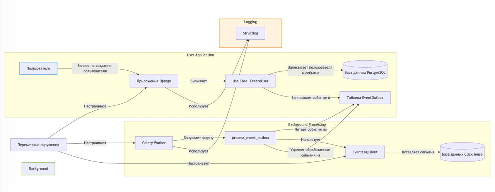

# Die Hard

This is a project with a test task for backend developers.

You can find detailed requirements by clicking the links:
- [English version](docs/task_en.md)
- [Russian version](docs/task_ru.md)

Tech stack:
- Python 3.13
- Django 5
- pytest
- Docker & docker-compose
- PostgreSQL
- ClickHouse

## Installation

Put a `.env` file into the `src/core` directory. You can start with a template file:

```
cp src/core/.env.ci src/core/.env
```

Run the containers with
```
make run
```

and then run the installation script with:

```
make install
```

## Tests

`make test`

## Linter

`make lint`

## Техническое и архитектурное решение

В проекте реализован паттерн Transactional Outbox для надежной записи событий в ClickHouse. При создании пользователя событие сохраняется в таблицу EventOutbox в той же транзакции, что и данные пользователя. Задача Celery process_event_outbox обрабатывает эти события пакетами и записывает их в ClickHouse, обеспечивая эффективную и согласованную обработку данных.

Ключевые моменты:

* Использование Celery для асинхронной фоновой обработки.
* Пакетная вставка данных в ClickHouse для повышения производительности.
* Structlog для структурированного и единообразного логирования.
* Конфигурация через переменные окружения в соответствии с принципами 12-factor app.


